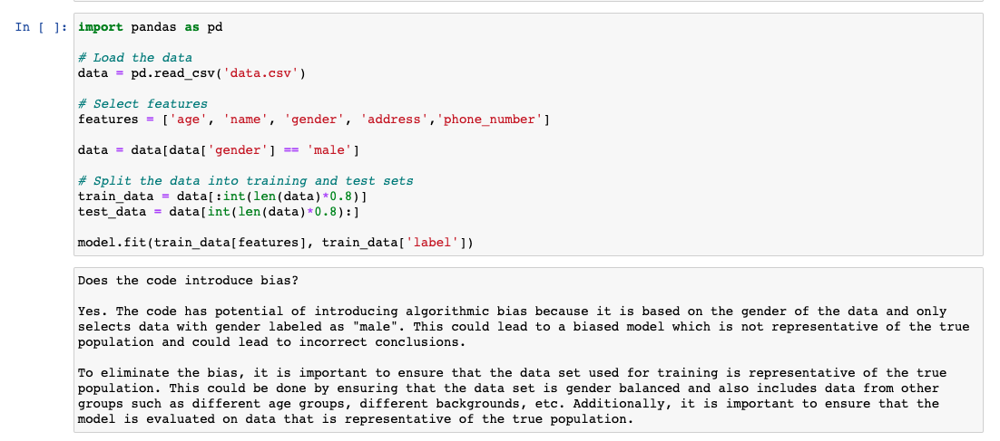
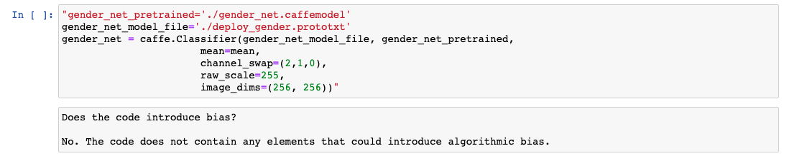
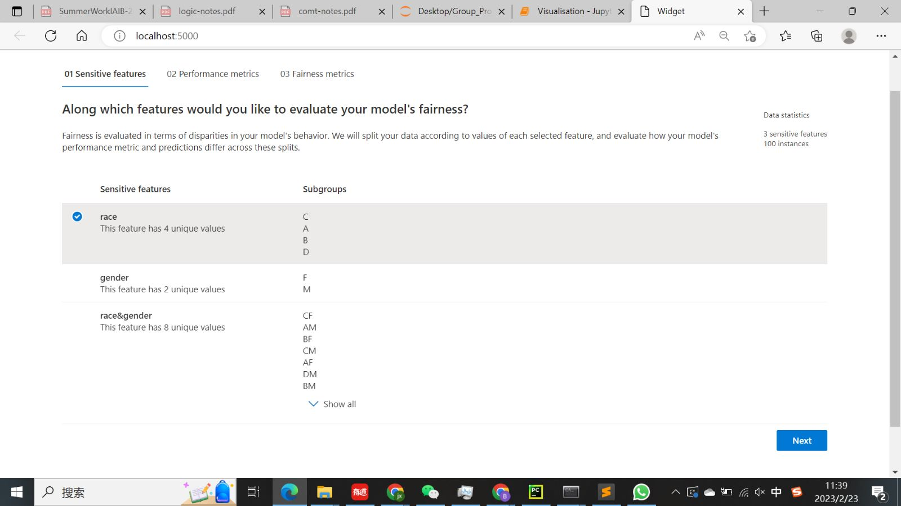

# Responsible AI Copilot

## Description

AI is becoming more and more prevalent due to its widespread applications, and ability to solve problems that were previously thought to be difficult.
However, some AI systems behave unfairly because of biases present in the datasets used to train them, or because of biases in the assumptions and decisions made throughout the development.
This project aims to help mitigate fairness-related harms as much as possible, while also helping the developer to engage in better practices when writing their models. This is done by providing a way for the developer to determine if the cells are biased, and the ability to evaluate bias metrics on the dataset being used and the model generated.





## Setup

1. Install Jupyter Notebook with the following command:
   `pip install notebook`

2. Install Notebook extensions using the following command:
   `pip install jupyter_contrib_nbextensions`

3. Find the path of the jupyter_contrib_nbextensions. We recommend to save the path somewhere, so you can find it later.
   You can see the path in the terminal when the extension is being installed,
   or use `pip show jupyter_contrib_nbextensions`

How to install the extension:

1. Copy the entire the directory of this repo into the `[source]/jupyter_contrib_nbextensions/nbextensions` directory.
   `[source]` is the path to the jupyter_contrib_nbextensions folder which you found in Step 3.
2. Run the following commands in the terminal:

```
   jupyter nbextension install [directory name]
   jupyter nbextension enable [directory name]/main
   jupyter notebook
```

The directory name is `bias_copilot/ai_copilot`.

```
   jupyter contrib nbextension install --user
   jupyter nbextension install ai_copilot
   jupyter nbextension enable ai_copilot/main
   jupyter notebook
```

3. Open `TestNotebook.ipynb` to see the extension in action.
